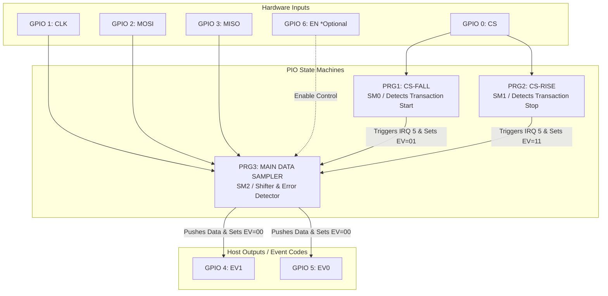

# SPI Sniffer PIO

A high-performance, passive SPI sniffer designed for the RP2040 and RP2350 microcontrollers. This project utilizes the hardware PIO (Programmable I/O) state machines to capture SPI traffic synchronously and streams the data over high-speed USB CDC to a host-side decoder.

## Features

- **Vendor-Agnostic & Portable:** Decoupled from hardcoded GPIO configurations. Supports standard Raspberry Pi Pico hardware and the Bus Pirate 5 using a `BOARD_INIT` macro pattern.
- **Dynamic Pin Mapping:** PIO state machines utilize relative pin mapping configured completely via macros at the top of `main.c`.
- **Hardware-Assisted Capture:** Low-overhead data acquisition using raw PIO processing combined with localized RAM buffering.
- **Automated Workflow:** Flat directory structure with a root-level Makefile wrapper for seamless compilation.
- **Host Decoder Included:** Python-based scripts to process, parse, and analyze captured SPI transactions in real time.

## Directory Structure

```text
.
├── CMakeLists.txt     # Build configuration optimized for Pico SDK
├── Makefile           # Root-level build automation wrapper
├── .gitignore         # Build artifact exclusions
├── README.md          # Project documentation
├── main.c             # Unified configuration and core system logic
├── ram_fifo.c         # Local ring-buffer implementation
├── ram_fifo.h
├── spi_sniffer.pio    # Refactored PIO script with relative pin mapping
└── tools/
    └── rfid_decoder.py # Host-side Python validation and decoding script

## PIO-Based SPI Sniffer Working Principle

The firmware leverages the RP2040/RP2350 Programmable I/O (PIO) blocks to achieve low-latency, hardware-level capture of SPI frames without CPU intervention during transmission. The architecture is inspired by a proven internal IRQ/WAIT synchronization mechanism originally designed for I2C sniffing.

To fully decode the SPI transaction lifecycle, the system utilizes three specialized PIO state machines (SM) running concurrent programs coordinated via internal interrupts (`IRQ 5`) and auxiliary event signaling pins.

### Architecture Diagram



## Detailed Component Breakdown
### 1. PRG1: CS-FALL (Transaction Initialization)
* Role: Monitors the Chip Select (CS) line for a high-to-low transition.

* Operation: As soon as a falling edge is detected on the CS pin, it marks the beginning of an SPI frame. It sets the external event configuration code to START (0x01) via the auxiliary pins (EV1, EV0) and fires the internal hardware interrupt IRQ 5. This immediately signals and synchronizes the main data sampler program.

### 2. PRG2: CS-RISE (Transaction Termination)
- Role: Monitors the Chip Select (CS) line for a low-to-high transition.

* Operation: When the master de-asserts the CS line, this program detects the rising edge, immediately flags the event pins with the STOP (0x11) code, and triggers IRQ 5. This acts as an asynchronous abort/cleanup signal for the main data loop.

### 3. PRG3: Main Data Sampler & Processing Loop
* Role: Handles synchronization with the SPI serial clock (CLK), shifts raw data from both data lines, and ensures protocol integrity.

* Operation:

    * Data Shifting: Upon receiving the initialization trigger from IRQ 5 (via PRG1), it begins sampling both MISO and MOSI lines on the configured edge of the incoming CLK signal.

    * FIFO Management: It relies on the PIO's hardware FIFO AUTO PUSH mechanism to efficiently stream full parsed data blocks down to the RX FIFO buffer where the CPU or DMA can collect them. During regular transmissions, it signals the DATA (0x00) state on the event pins.

    * Bit Missing Detection: If a rising edge interrupt from PRG2 occurs before a full byte structure is shifted in, PRG3 catches the condition, flags a framing error ("Bit Missing"), flushes its internal shift registers, and prepares for the next transaction.

## Hardware Configuration & Pinout

| Signal Name | Pin Assignment | Direction | Description |
| :---: | :--- | :---: | :--- |
| CS |  GPIO 0 |  Input |  SPI Chip Select (Active Low) | 
|  CLK |  GPIO 1 |  Input |  SPI Serial Clock |  
|  MOSI |  GPIO 2 |  Input |  Master Output Slave Input data line |  
|  MISO |  GPIO 3 |  Input |  Master Input Slave Output data line | 
| EV1 | GPIO 4 | Output | Event Code Bit 1 | 
| EV0 | GPIO 5 | Output | Event Code Bit 0 | 
| EN | GPIO 6 | Input | Hardware Capture Enable (Optional) |

## Event Code Truth Table
The downstream host-side decoder uses the status of the auxiliary event pins (EV1, EV0) to accurately reconstruct the packet lifecycle stream:

| EV1 | EV0 | Protocol State Event | Technical Condition |
| :---: | :--- | :---: | :--- |
| 0 | 0 | DATA | Normal operational data byte transfer via MISO/MOSI lines. |
| 0 | 1 | START | CS Falling Edge detected. The sniffer engine resets its buffers. |
| 1 | 1 | STOP | CS Rising Edge detected. Frame closed; incomplete bytes flagged as missing bits. |
