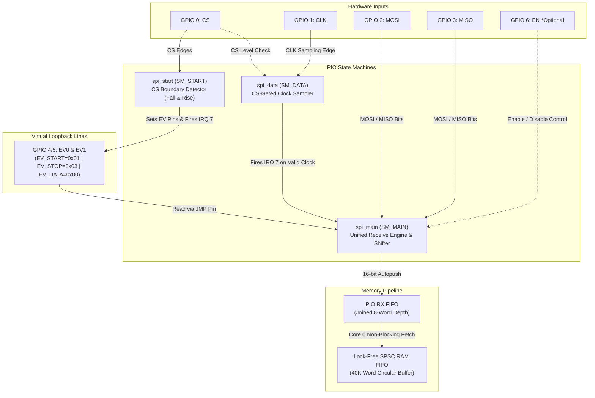
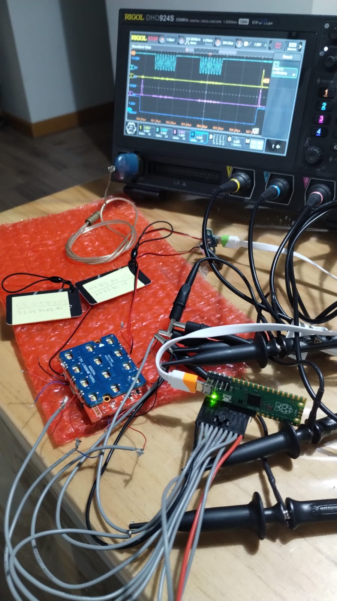
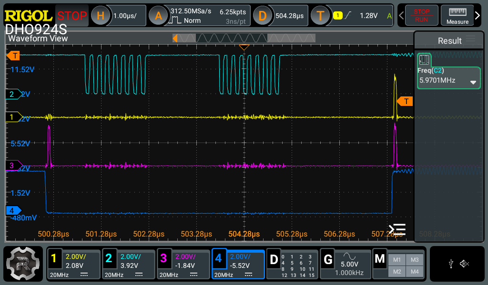
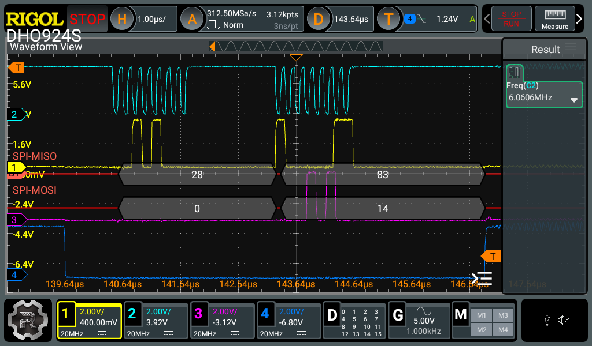
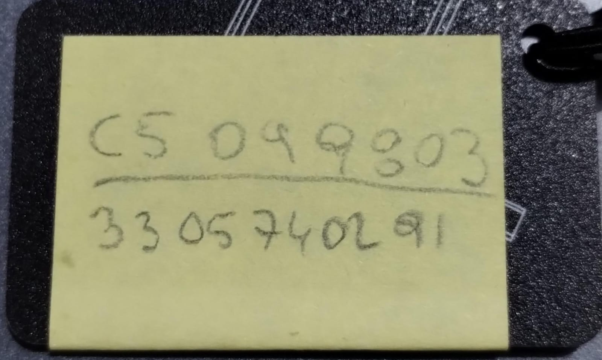
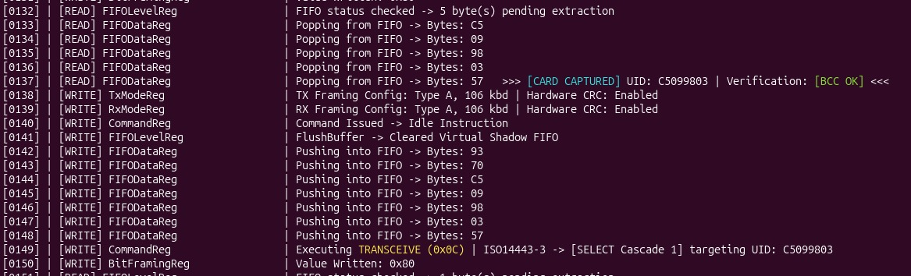
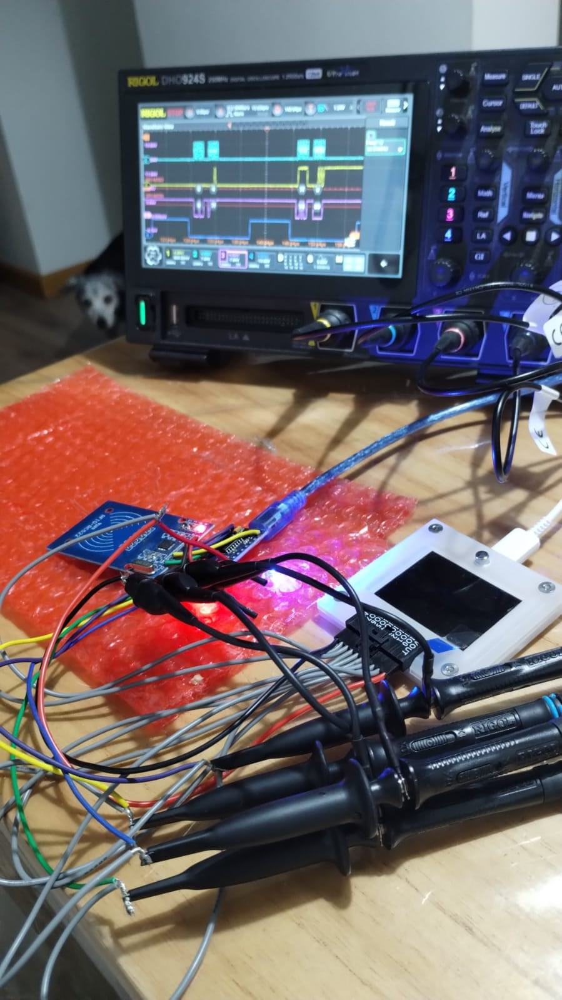
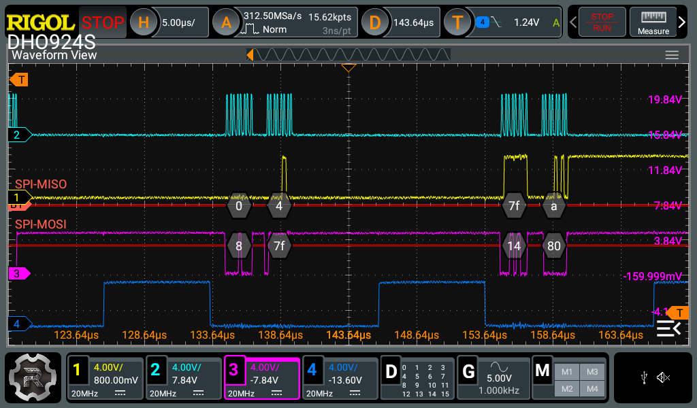
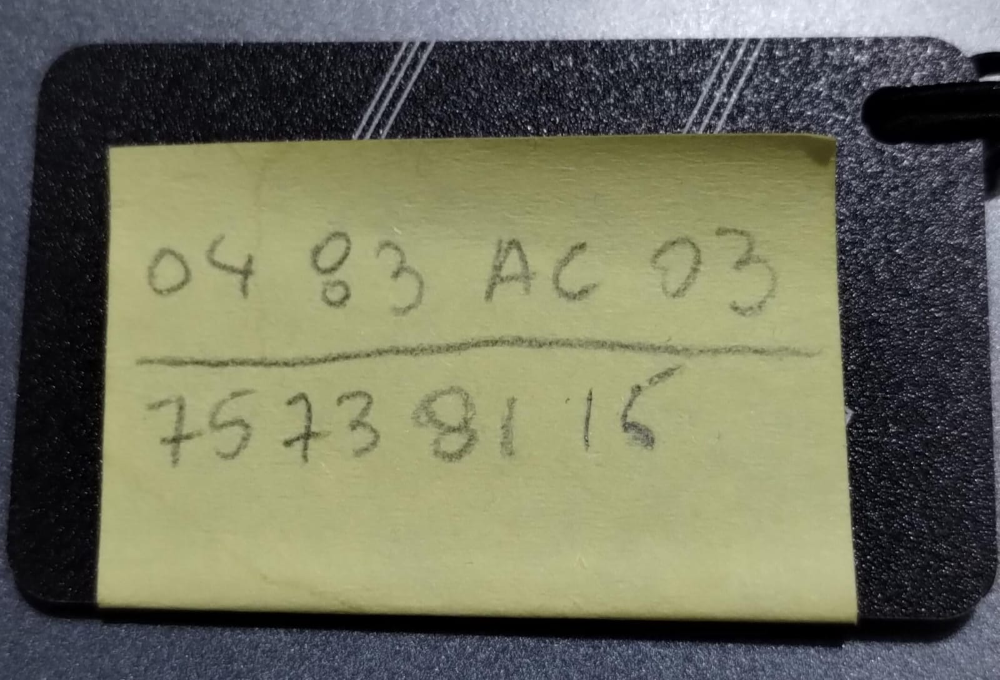
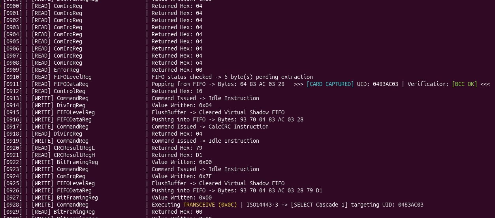

# SPI Sniffer PIO

A high-performance, passive SPI sniffer designed for the RP2040 and RP2350 microcontrollers. This project utilizes the hardware PIO (Programmable I/O) state machines to capture SPI traffic synchronously and streams the data over high-speed USB CDC to a host-side decoder.

## Features

- **Vendor-Agnostic & Portable:** Decoupled from hardcoded GPIO configurations. Supports standard Raspberry Pi Pico hardware and the Bus Pirate 5 using a `BOARD_INIT` macro pattern.
- **Dynamic Pin Mapping:** PIO state machines utilize relative pin mapping configured completely via macros at the top of `main.c`.
- **Hardware-Assisted Capture:** Low-overhead data acquisition using raw PIO processing combined with localized RAM buffering.
- **Automated Workflow:** Flat directory structure with a root-level Makefile wrapper for seamless compilation.
- **Host Decoder Included:** Python-based scripts to process, parse, and analyze captured SPI transactions in real time.

## Directory Structure

```text
.
├── CMakeLists.txt     # Build configuration optimized for Pico SDK
├── Makefile           # Root-level build automation wrapper
├── .gitignore         # Build artifact exclusions
├── README.md          # Project documentation
├── main.c             # Unified configuration and core system logic
├── ram_fifo.c         # Local ring-buffer implementation
├── ram_fifo.h
├── spi_sniffer.pio    # Refactored PIO script with relative pin mapping
└── tools/
    └── rfid_decoder.py # Host-side Python validation and decoding script
```

## PIO-Based SPI Sniffer Working Principle

The firmware leverages the RP2040/RP2350 Programmable I/O (PIO) blocks to achieve low-latency, hardware-level capture of SPI frames without CPU intervention during transmission. The architecture is inspired by a proven internal IRQ/WAIT synchronization mechanism originally designed for I2C sniffing.

To fully decode the SPI transaction lifecycle, the system utilizes three specialized PIO state machines (SM) running concurrent programs coordinated via internal interrupts (`IRQ 5`) and auxiliary event signaling pins.

### Architecture Diagram



## Detailed Component Breakdown
### 1. PRG1: CS-FALL (Transaction Initialization)
* Role: Monitors the Chip Select (CS) line for a high-to-low transition.

* Operation: As soon as a falling edge is detected on the CS pin, it marks the beginning of an SPI frame. It sets the external event configuration code to START (0x01) via the auxiliary pins (EV1, EV0) and fires the internal hardware interrupt IRQ 5. This immediately signals and synchronizes the main data sampler program.

### 2. PRG2: CS-RISE (Transaction Termination)
- Role: Monitors the Chip Select (CS) line for a low-to-high transition.

* Operation: When the master de-asserts the CS line, this program detects the rising edge, immediately flags the event pins with the STOP (0x11) code, and triggers IRQ 5. This acts as an asynchronous abort/cleanup signal for the main data loop.

### 3. PRG3: Main Data Sampler & Processing Loop
* Role: Handles synchronization with the SPI serial clock (CLK), shifts raw data from both data lines, and ensures protocol integrity.

* Operation:

    * Data Shifting: Upon receiving the initialization trigger from IRQ 5 (via PRG1), it begins sampling both MISO and MOSI lines on the configured edge of the incoming CLK signal.

    * FIFO Management: It relies on the PIO's hardware FIFO AUTO PUSH mechanism to efficiently stream full parsed data blocks down to the RX FIFO buffer where the CPU or DMA can collect them. During regular transmissions, it signals the DATA (0x00) state on the event pins.

    * Bit Missing Detection: If a rising edge interrupt from PRG2 occurs before a full byte structure is shifted in, PRG3 catches the condition, flags a framing error ("Bit Missing"), flushes its internal shift registers, and prepares for the next transaction.

## Hardware Configuration & Pinout

| Signal Name | Pin Assignment | Direction | Description |
| :---: | :--- | :---: | :--- |
| CS |  GPIO 0 |  Input |  SPI Chip Select (Active Low) | 
|  CLK |  GPIO 1 |  Input |  SPI Serial Clock |  
|  MOSI |  GPIO 2 |  Input |  Master Output Slave Input data line |  
|  MISO |  GPIO 3 |  Input |  Master Input Slave Output data line | 
| EV1 | GPIO 4 | Output | Event Code Bit 1 | 
| EV0 | GPIO 5 | Output | Event Code Bit 0 | 
| EN | GPIO 6 | Input | Hardware Capture Enable (Optional) |

## Event Code Truth Table
The downstream host-side decoder uses the status of the auxiliary event pins (EV1, EV0) to accurately reconstruct the packet lifecycle stream:

| EV1 | EV0 | Protocol State Event | Technical Condition |
| :---: | :--- | :---: | :--- |
| 0 | 0 | DATA | Normal operational data byte transfer via MISO/MOSI lines. |
| 0 | 1 | START | CS Falling Edge detected. The sniffer engine resets its buffers. |
| 1 | 1 | STOP | CS Rising Edge detected. Frame closed; incomplete bytes flagged as missing bits. |

## Getting Started

### Quick Start (Precompiled Binaries)

If you want to use the sniffer immediately without installing compiling tools, you can use the pre-built binaries included in this repository:

* **Locate the Binaries**: Navigate to the `bin/` directory in the root of this project.
* **Select Your Architecture**:
    * Download `spi_sniffer_pio_rp2040.uf2` if you are using the original Raspberry Pi Pico (RP2040).
    * Download `spi_sniffer_pio_rp2350.uf2` if you are deploying to the Raspberry Pi Pico 2 (RP2350).
* **Flash the Board**: Connect your Pico board to your computer via USB while holding down the `BOOTSEL` button, then drag and drop the corresponding `.uf2` file into the mounted mass storage volume.

---

### Development Environment Setup

To compile the firmware from source, your environment must have the ARM GNU Toolchain and the Raspberry Pi Pico SDK (version 2.0.0 or higher is required to compile for the RP2350 platform).

* **Toolchain Installation**: For an automated, streamlined setup of the SDK and compiler tools on Linux or Raspberry Pi OS environments, you can follow the official automated setup resources available at the [Raspberry Pi Pico Setup Repository](https://github.com/raspberrypi/pico-setup).
* **Environment Configuration**: Make sure that the `PICO_SDK_PATH` environment variable is correctly exported and points to your local installation directory of the Pico SDK.

---

### Building from Source

This project includes a root-level `Makefile` wrapper to automate the standard `cmake` and `make` sequence, eliminating the need for manual build directory navigation.

1. Clone the repository and enter the project directory:
```bash
git clone https://github.com/jjsch-dev/spi_sniffer_pio.git
cd spi_sniffer_pio
```
2. Compile for your specific target hardware:

* For Raspberry Pi Pico (RP2040):

```bash
make pico1
```
This command initializes the build folder, targets the standard Pico board profile, runs compilation, and automatically places the output inside bin/spi_sniffer_pio_rp2040.uf2.

* For Raspberry Pi Pico 2 (RP2350):

```bash
make pico2
```
This command configures the build setup utilizing the pico2 board profile to compile for the new architecture, placing the final binary inside bin/spi_sniffer_pio_rp2350.uf2.

2. Clean the environment:
To wipe out the generated build artifacts and clear the precompiled binary folder, run:
```bash
make clean
```

## Hardware & System Configuration

The project features a centralized global configuration profile using C preprocessor macros. This abstraction layer enables seamless transitioning between hardware platforms, pin configurations, and host-side telemetry formatting before compiling the firmware.

### 1. Target Hardware Selection Profile

The firmware adapts its underlying pin mapping and system initialization code by toggling the main hardware profile macro:

* **Bus Pirate 5 Mode (`TARGET_BUS_PIRATE_5 1`)**:
    * **Target Architecture**: Optimizes the system topology for the Bus Pirate 5 hardware interface.
    * **Pin Mapping**: Automatically binds the SPI tap inputs and event lines to physical GPIOs 8 through 13.
    * **Hardware Abstraction**: Configures `BOARD_INIT()` to invoke `init_bus_pirate_v5_buffers()`, ensuring that on-board bidirectional voltage shifters and logic buffers are safely initialized before execution.
* **Standard Pico Mode (`TARGET_BUS_PIRATE_5 0`)**:
    * **Target Architecture**: Provisions a clean layout for standalone Raspberry Pi Pico or Pico 2 boards.
    * **Pin Mapping**: Maps all connections to a flat, sequential layout using GPIOs 0 through 5.
    * **Hardware Abstraction**: Binds `BOARD_INIT()` to an optimized, compiler-friendly no-op expression (`((void)0)`), eliminating call overhead.

### 2. Dynamic Hardware Gating

You can dynamically isolate or trigger data acquisition using an external tracking pin:

* **`SPI_TAP_ENABLE_PIN_CONFIG`**:
    * Set to `1` to activate dynamic hardware gating. The PIO data sampling machine evaluates the state of the designated validation pin, restricting data storage exclusively to windows when the target system is operationally active.
    * Set to `0` to disable gating. The PIO engine captures data continuously, bypassing pin level evaluation.
* **`SPI_TAP_ENABLE_PIN`**:
    * Sets the specific GPIO number (defaults to GPIO 14) dedicated to tracking the status or activation signal of the target board.

### 3. System Settings & Telemetry Formatting

These definitions balance data output structure against available serialization throughput:

* **`SNIFFER_COMPACT_MODE`**:
    * **Value `0` (Verbose Mode)**: Generates human-readable console outputs, tracking text labels alongside individual line events. Ideal for direct terminal monitoring.
    * **Value `1` (Compact Parallel Hex Stream)**: Outputs compressed, highly structured parallel hexadecimal frames. This minimizes serial bus congestion and is optimized for processing by host-side Python decoders.
* **`SNIFFER_TELEMETRY`**:
    * **Value `1` (Diagnostics Active)**: Interleaves low-level runtime metadata within the execution pipeline to analyze state machine performance and processing loops.
    * **Value `0` (Clean Production)**: Deactivates non-essential diagnostic output, preserving 100% of the transmission bandwidth for decoded SPI traffic.

## Real-World Validation & Hardware Verification

To validate signal integrity, timing precision, and decoding accuracy, the sniffer was tested on an electronic lock board equipped with an **NZ3801-AB** RFID reader IC (a pin-to-pin and functionally compatible alternative to the NXP MFRC522). 

Simultaneous captures were performed using a **Raspberry Pi Pico (RP2040)** running this sniffer firmware alongside a **Rigol DHO924S 12-bit Oscilloscope** executing hardware SPI decoding.

---

### Hardware Testbench & Shared Bus Filtering Setup

The target battery-powered lock architecture uses a single, shared SPI bus connecting the main Host CPU to both the **NZ3801-AB RFID Reader** and an **external SPI Flash chip** (storing system code and audio assets). 

To prevent unwanted SPI Flash traffic from flooding the sniffer's RAM buffer:
* The sniffer connects to `CS`, `CLK`, `MOSI`, and `MISO`.
* The **`SPI_TAP_ENABLE_PIN`** is tapped directly to the target's `NRSTPW` (Power Down / Reset) line controlled by the Host CPU.
* **Hardware Dynamic Gating**: When `NRSTPW` goes LOW (RFID chip inactive/power-down), the sniffer automatically halts PIO execution. When `NRSTPW` transitions HIGH, the sniffer clears residual RX noise and enables capture strictly for RFID transactions.



*Figure 1: Physical test bench setup showing the electronic lock PCB, RFID ISO/IEC 14443A key fobs, Raspberry Pi Pico sniffer with dynamic tap gating, and Rigol oscilloscope probes.*

---

### PIO Hardware Event Synchronization (`EV0` / `EV1`)

To ensure zero-latency frame demarcation without CPU intervention, internal PIO state machines toggle virtual loopback event pins (`EV0` / `EV1`) on transaction boundaries:

* **`EV_START` (0x01)**: Triggered immediately when `CS` transitions from HIGH to LOW (falling edge).
* **`EV_STOP`  (0x03)**: Triggered when `CS` returns to HIGH (rising edge).



*Figure 2: Oscilloscope trace showing `CS` assertion (CH4 Blue), SPI Clock bursts (CH2 Cyan), and the ultra-narrow hardware pulses generated on `EV0`/`EV1` (CH3 Magenta / CH1 Yellow) marking the exact frame boundaries.*

---

### Decoder Verification: Sniffer Stream vs. Scope Hardware Decoder

The accuracy of the lock-free LUT deinterleaving engine was verified by comparing the sniffer's compact serial output against the oscilloscope's hardware SPI protocol analyzer during active RFID polling cycles.



*Figure 3: Rigol SPI hardware decoder analyzing a 2-byte transfer cycle.*

#### Protocol Analysis Breakdown:
* **Oscilloscope Hardware Decode:**
  * **Byte 0**: `MISO = 0x28`, `MOSI = 0x00`
  * **Byte 1**: `MISO = 0x83`, `MOSI = 0x14`
* **Sniffer Compact Stream Output:**
  `S28008314P`

```text
 S  [28 - 00]  [83 - 14]  P
 │    │    │     │    │   └── Stop Condition (CS Rise)
 │    │    │     │    └────── MOSI Byte 1 (0x14)
 │    │    │     └─────────── MISO Byte 1 (0x83)
 │    │    └───────────────── MOSI Byte 0 (0x00)
 │    └────────────────────── MISO Byte 0 (0x28)
 └─────────────────────────── Start Condition (CS Fall)
 ```
 ## High-Level Protocol & Register Decoder (`rfid_decoder.py`)

To transform raw hardware SPI hex streams into actionable protocol insights, the repository includes an automated Python analysis utility located in `tools/rfid_decoder.py`. 

This tool performs real-time or offline register mapping for **MFRC522** and **NZ3801-AB** RFID controllers. It maps register addresses, interprets internal FIFO operations, and reconstructs high-level **ISO/IEC 14443-A** anti-collision and selection sequences.

---

### Key Features & CLI Usage

The script supports both **live capture** via USB CDC serial streaming and **offline log file processing**:

```bash
# Live decoding directly from the Pico USB CDC port (Compact Mode)
./tools/rfid_decoder.py -s /dev/ttyACM0 -c -o spi_NZ3801.log

# Offline analysis of a previously saved sniffer log
./tools/rfid_decoder.py -f captures/spi_raw_dump.log -c
```

#### Command-Line Arguments:
| Argument | Long Option | Description |
| :--- | :--- | :--- |
| `-s` | `--serial` | System identifier for live USB CDC serial port (e.g. `/dev/ttyACM0`) |
| `-f` | `--file` | Path to a saved raw sniffer log file for offline processing |
| `-c` | `--compact` | Enables decoding for the new ultra-compact stream format (`S88000044P`) |
| `-o` | `--output` | Path to export a clean, ANSI-color-free log file for documentation |
| `-b` | `--baud` | Serial transmission baud rate (Default: `115200`) |

> **Engineering Note — Why Use Compact Mode (`-c`)?**  
> High-frequency SPI bursts generate rapid data volumes. Verbose human-readable text streams can easily saturate the **64-byte USB CDC endpoint buffer** (Full-Speed USB packet limit). This serial transmission bottleneck creates backpressure that risks overflowing the internal lock-free `ram_fifo`.  
>  
> The **ultra-compact format** reduces payload footprint to a minimum (e.g., `S88000044P` for a complete transaction cycle), maximizing USB throughput and guaranteeing zero frame loss during high-density transaction bursts.

---

### Real-Time ISO14443-A Card Capture Example

During active RFID polling by the target electronic lock, `rfid_decoder.py` tracks the internal reader FIFO during the **CASCADE 1 ANTICOLLISION** sequence, automatically verifying the card UID and its parity/BCC byte.

#### Physical Test Card:


*Figure 4: Physical ISO/IEC 14443A key fob with printed UID `C5 09 98 03`.*

#### Live Decoder Console Output:


*Figure 5: Live terminal decoding output showing register state changes, FIFO pop operations, and successful automatic UID extraction (`C5099803`) with BCC validation.*

#### Reconstructed Protocol Flow:
1. **FIFO Extraction**: The host CPU reads 5 bytes sequentially from `FIFODataReg` (`0xC5`, `0x09`, `0x98`, `0x03`, `0x57`).
2. **UID Reconstruction**: The script combines the nibbles to identify UID `C5099803` and verifies the final XOR checksum (`BCC OK`).
3. **Command Tracking**: The script captures the subsequent `TRANSCEIVE (0x0C)` command sent to `CommandReg` to complete the `SELECT Cascade 1` phase.

## Bus Pirate v5 (BP5) Integration & 5V Logic Benchmarking

To demonstrate system flexibility across different voltage domains and continuous polling architectures, the sniffer firmware was benchmarked on a classic **Arduino Nano (5V logic)** paired with an **NXP MFRC522 RFID shield**.

---

### Hardware Interfacing & 5V Level Shifting

Standard RP2040/RP2350 development boards (e.g., Pico Berry) feature 3.3V-tolerant GPIOs. Tapping directly into a 5V Arduino SPI bus risks exceeding the microcontroller's maximum electrical ratings ($V_{IN} > 3.63\text{V}$), leading to missed signal edge transitions or permanent hardware degradation.

The **Bus Pirate v5 (BP5)** natively solves this issue through its onboard bidirectional level shifters (**`AiP74LVC1T45GC363.T`**) on all buffer pins:

* **Voltage Reference Connection**: The **RED VREF cable** on the BP5 buffer header **must be connected to the target's +5V power rail**. This provides the exact high-side reference voltage for the `AiP74LVC1T45GC363.T` transceivers to safely level-shift 5V SPI signals down to 3.3V for the onboard Pico core.



*Figure 6: Bus Pirate v5 connected to the 5V Arduino Nano SPI bus with VREF tapped to +5V, alongside Rigol oscilloscope logic probes.*

---

### High-Density Continuous Polling Stress Test

Unlike battery-powered lock firmware that enters sleep states between card reads, typical Arduino MFRC522 libraries run an aggressive, unmitigated polling loop.

* **Clock Frequency vs. Bus Load**: Although the Arduino SPI clock runs at a lower frequency (**4 MHz** compared to the 6 MHz used in the battery lock), the continuous execution sends non-stop back-to-back command bursts:
  ```text
  S08007F04P  --> Read/Write Command
  S147F800AP  --> FIFO / Control Check
  S88000004P  --> Status Polling
  ```
* **FIFO Throughput Stress**: This non-stop command repetition creates higher sustained byte-per-second throughput than event-driven architectures. The lock-free `ram_fifo` successfully handles this continuous burst stream without dropping frames or incurring USB CDC overrun.



*Figure 7: Rigol oscilloscope trace decoding the high-speed repeating `S08007F04P` and `S147F800AP` continuous polling frames captured via BP5.*

---

### Verification: Live Card Detection (`UID: 0483AC03`)

When an ISO/IEC 14443A key fob is presented to the MFRC522 coil under continuous Arduino polling:

#### Physical Card:


*Figure 8: Test key fob with target UID `04 83 AC 03`.*

#### Decoder Stream Capture:


*Figure 9: `rfid_decoder.py` capturing the rapid 5V Arduino stream, isolating `FIFODataReg` pops (`04 83 AC 03 28`), and confirming successful `[CARD CAPTURED] UID: 0483AC03 | Verification: [BCC OK]`.*
